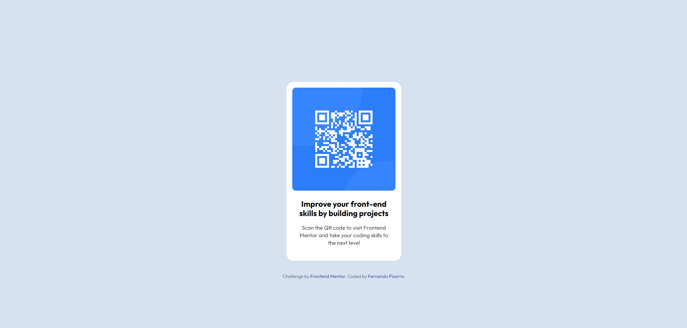

# Frontend Mentor - QR Code Component

This is a solution to the [QR code component challenge](https://www.frontendmentor.io/challenges/qr-code-component-iux_sIO_H) on Frontend Mentor.

## Table of contents

- [Overview](#overview)
  - [The challenge](#the-challenge)
  - [Screenshot](#screenshot)
  - [Links](#links)
- [My process](#my-process)
  - [Built with](#built-with)
  - [What I learned](#what-i-learned)
- [Author](#author)

## Overview

### The challenge

Users should be able to:

- See a centered QR code card on desktop and mobile screens

### Screenshot

### Links

- Solution URL: [GitHub Repo](https://github.com/fernandopizarrodw/qr-code-component)
- Live Site URL: [GitHub Pages](https://fernandopizarrodw.github.io/qr-code-component/)

## My process

### Built with

- Semantic HTML5 markup
- CSS custom properties (variables)
- Flexbox
- Mobile-first workflow

### What I learned

I practiced how to:

- Build a responsive layout with Flexbox
- Use `margin` shorthand notation efficiently
- Create a clean structure with semantic HTML
- Implement design based on a Figma file

## Author

- GitHub – [@fernandopizarrodw](https://github.com/fernandopizarrodw)
- Frontend Mentor – [@fernandopizarrodw](https://www.frontendmentor.io/profile/fernandopizarrodw)
- LinkedIn – [Fernando Pizarro](https://www.linkedin.com/in/fernandopizarro-dev/)
